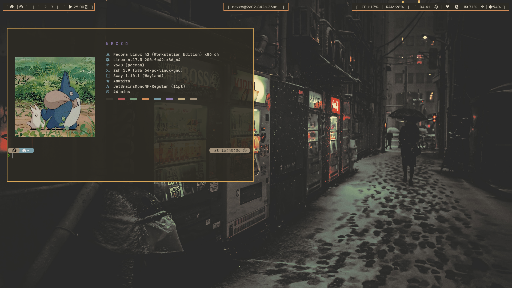
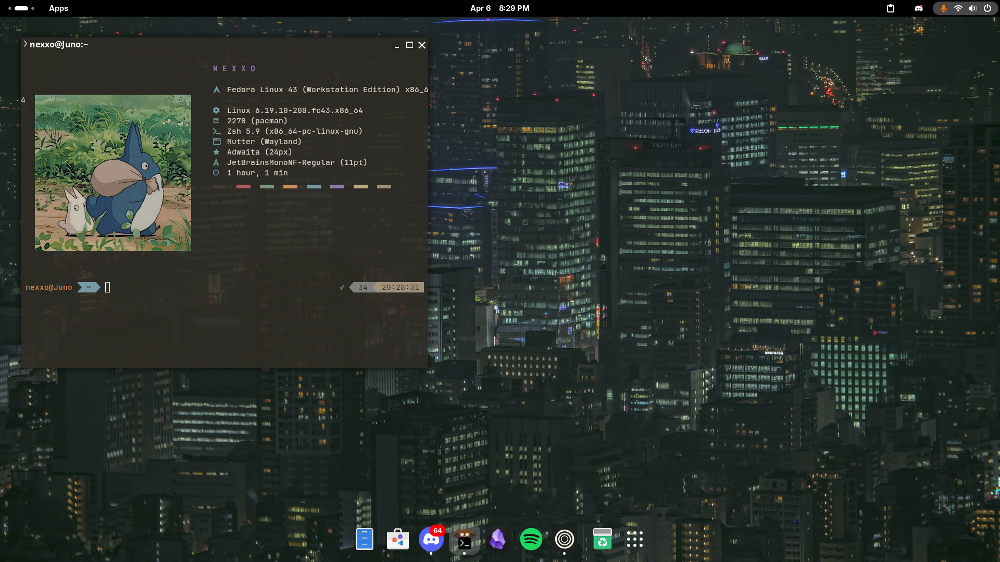

# A simple config sway with gruvbox theme 

## Also have for Gnome

## Install 
You can use the script for install my config, you can choose between sway or gnome 

## Work in progress 
- [x] script gnome 
- [ ] script sway 
